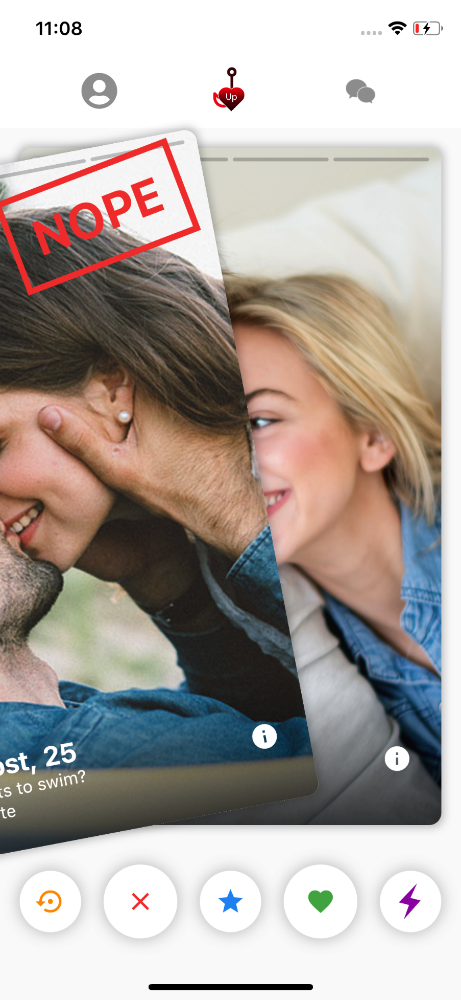
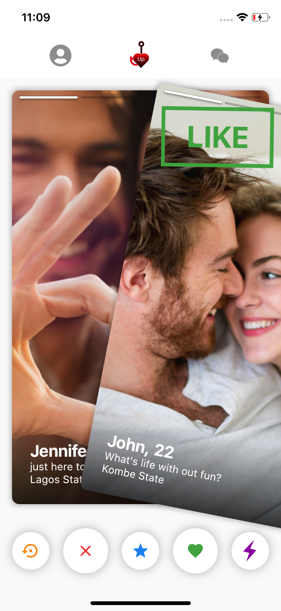
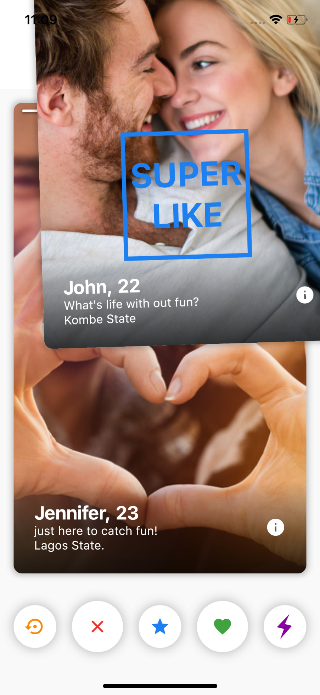
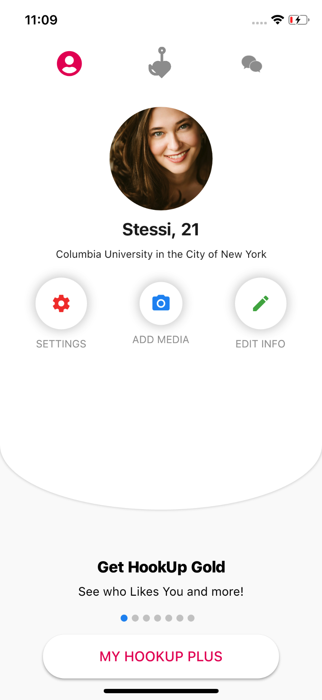
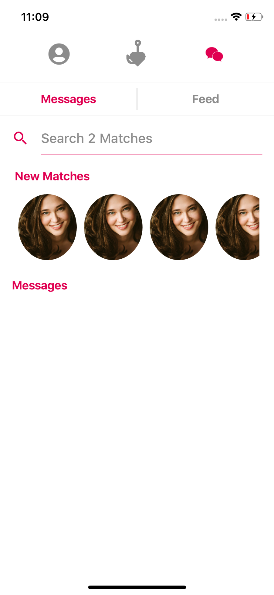

# Hookup
Just Another Flutter Dating app UI ...Kinda Tina Cloned UI Thanks to Fluttery....


  
 


## How To Use

1. Locally add fluttery into pubspec.yaml by downloading the repo from
> - [Fluttery GITHUB](https://github.com/matthew-carroll/fluttery)

Open the pubspec.yaml of fluttery and replace the enviroment to the one below

```
environment:
  sdk: ">=2.0.0-dev.28.0 <3.0.0"
  flutter: ">=0.1.4 <2.0.0"
```

then import into your code the normal way you know how..
```
 fluttery:
```

2. Locate the fluttery folder in my project copy the layout_overlays.dart and replace the one located at fluttery/lib/src/layout_overlays.dart

3.  Run the project, it should work by now....

4. Watch the video on the Flutter Tinder Challenge by fluttery

    it would help you understand the basics of the swipe screens and concept behind it

> - [Fluttery](https://www.youtube.com/watch?v=NMHhzd5ewP4)


### :heart: Found this project useful?

If you found this project useful, then please consider giving it a :star: on Github and sharing it with your friends via social media.

## Project Created & Maintained By

### Maugost Mtellect

<a href="https://twitter.com/iMaugost"></a>
<a href="https://facebook.com/maugost.okore"></a>

# Donate

> If you found this project helpful or you learned something from the source code and want to thank me, consider buying me a cup of :coffee:
>
> - [Paystack NG](https://paystack.com/pay/iammaugost)


## Thanks

Special thanks to [Matthew Carroll](https://www.youtube.com/Fluttery) for your tutorial....


## Getting Started

This project is a starting point for a Flutter application.

A few resources to get you started if this is your first Flutter project:

- [Lab: Write your first Flutter app](https://flutter.io/docs/get-started/codelab)
- [Cookbook: Useful Flutter samples](https://flutter.io/docs/cookbook)

For help getting started with Flutter, view our 
[online documentation](https://flutter.io/docs), which offers tutorials, 
samples, guidance on mobile development, and a full API reference.
